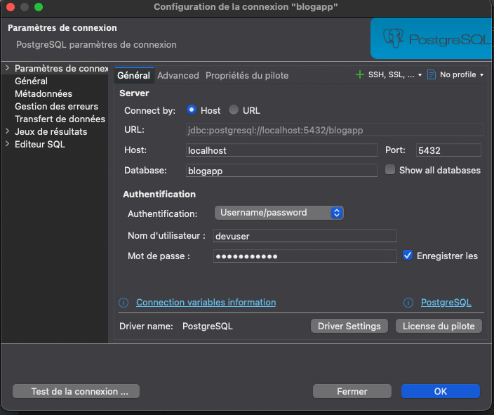
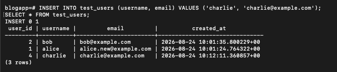
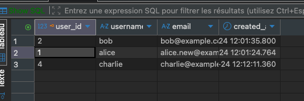
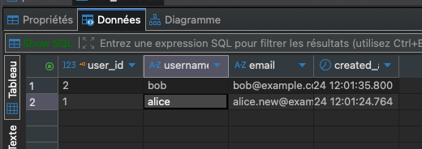

# PostgreSQL - Laboratoires

## Environnement

- Mac M2 8GB RAM
- Docker Desktop
- PostgreSQL 18.6
- DBeaver Community

---

## Lab 01 - Configuration de l'environnement

### Installation Docker + PostgreSQL 18

```bash
docker pull postgres:18
docker volume create pgdata
docker run -d --name postgres-dev \
  -e POSTGRES_PASSWORD=devpassword \
  -e POSTGRES_USER=devuser \
  -e POSTGRES_DB=blogapp \
  -p 5432:5432 \
  -v pgdata:/var/lib/postgresql \
  postgres:18
```

Note : PostgreSQL 18 change le chemin PGDATA. Le volume se monte sur `/var/lib/postgresql` et non `/var/lib/postgresql/data` comme en PG 16.

### Informations de connexion

```
 Parameter             | Value
-----------------------+---------------------
 Database              | blogapp
 Client User           | devuser
 Socket Directory      | /var/run/postgresql
 Server Port           | 5432
 Protocol Version      | 3.0
 Superuser             | on
```

### Structure de la table test_users

```sql
CREATE TABLE test_users (
    user_id SERIAL PRIMARY KEY,
    username VARCHAR(50) NOT NULL UNIQUE,
    email VARCHAR(255) NOT NULL,
    created_at TIMESTAMPTZ DEFAULT CURRENT_TIMESTAMP
);
```

```
   Column   |           Type           | Nullable |                Default
------------+--------------------------+----------+---------------------------------------------
 user_id    | integer                  | not null | nextval('test_users_user_id_seq'::regclass)
 username   | character varying(50)    | not null |
 email      | character varying(255)   | not null |
 created_at | timestamp with time zone |          | CURRENT_TIMESTAMP
```

### Configuration PostgreSQL

| Parametre            | Valeur |
| -------------------- | ------ |
| shared_buffers       | 128MB  |
| work_mem             | 4MB    |
| maintenance_work_mem | 64MB   |
| max_connections      | 100    |
| log_statement        | none   |

### Insertion et suppression de donnees

Insertion de 3 utilisateurs (alice, bob, charlie) puis suppression de charlie :

```sql
DELETE FROM test_users WHERE username = 'charlie';
```

```
 user_id | username |         email         |          created_at
---------+----------+-----------------------+-------------------------------
       2 | bob      | bob@example.com       | 2026-08-24 10:01:35.800229+00
       1 | alice    | alice.new@example.com | 2026-08-24 10:01:24.764322+00
```

### Transactions

Transaction avec COMMIT (dave est conserve) :

```
blogapp=# BEGIN;
BEGIN
blogapp=*# INSERT INTO test_users (username, email) VALUES ('dave', 'dave@example.com');
INSERT 0 1
blogapp=*# COMMIT;
COMMIT
blogapp=# SELECT * FROM test_users;
 user_id | username |         email         |          created_at
---------+----------+-----------------------+-------------------------------
       2 | bob      | bob@example.com       | 2026-08-24 10:01:35.800229+00
       1 | alice    | alice.new@example.com | 2026-08-24 10:01:24.764322+00
       5 | dave     | dave@example.com      | 2026-08-24 10:29:25.37553+00
(3 rows)
```

Transaction avec ROLLBACK (eve est annulee) :

```
blogapp=# BEGIN;
BEGIN
blogapp=*# INSERT INTO test_users (username, email) VALUES ('eve', 'eve@example.com');
INSERT 0 1
blogapp=*# SELECT * FROM test_users;
 user_id | username |         email         |          created_at
---------+----------+-----------------------+-------------------------------
       2 | bob      | bob@example.com       | 2026-08-24 10:01:35.800229+00
       1 | alice    | alice.new@example.com | 2026-08-24 10:01:24.764322+00
       5 | dave     | dave@example.com      | 2026-08-24 10:29:25.37553+00
       6 | eve      | eve@example.com       | 2026-08-24 10:33:02.298717+00
(4 rows)

blogapp=*# ROLLBACK;
ROLLBACK
blogapp=# SELECT * FROM test_users;
 user_id | username |         email         |          created_at
---------+----------+-----------------------+-------------------------------
       2 | bob      | bob@example.com       | 2026-08-24 10:01:35.800229+00
       1 | alice    | alice.new@example.com | 2026-08-24 10:01:24.764322+00
       5 | dave     | dave@example.com      | 2026-08-24 10:29:25.37553+00
(3 rows)
```

Le ROLLBACK a annule l'insertion d'eve. Seuls alice, bob et dave restent.

### Captures

#### Connexion DBeaver



#### Insertion de charlie



#### Visualisation dans DBeaver



#### Suppression de charlie (DBeaver)



---

### Commandes Docker utiles

```bash
docker stop postgres-dev      # Arreter
docker start postgres-dev     # Demarrer
docker restart postgres-dev   # Redemarrer
docker logs postgres-dev      # Voir les logs
docker exec -it postgres-dev psql -U devuser -d blogapp  # Se connecter
```

### Commandes psql essentielles

| Commande         | Description                 |
| ---------------- | --------------------------- |
| `\l`             | Lister les bases de donnees |
| `\dt`            | Lister les tables           |
| `\d nom_table`   | Decrire une table           |
| `\du`            | Lister les roles            |
| `\conninfo`      | Informations de connexion   |
| `\timing on/off` | Chronometrage des requetes  |
| `\x`             | Affichage etendu            |
| `\q`             | Quitter psql                |

---

## Lab 02 - DDL & DML : Conception de schema et manipulation de donnees

### Chargement de la base Pagila

Pagila est la base d'exemple officielle PostgreSQL (magasin de location de DVD). Chargement dans le conteneur :

```bash
docker exec -it postgres-dev bash
apt update && apt install -y wget
wget https://raw.githubusercontent.com/devrimgunduz/pagila/master/pagila-schema.sql
wget https://raw.githubusercontent.com/devrimgunduz/pagila/master/pagila-data.sql
psql -U devuser -d postgres -c "CREATE DATABASE pagila;"
psql -U devuser -d pagila -f pagila-schema.sql
psql -U devuser -d pagila -f pagila-data.sql
```

Erreurs normales lors du chargement :

- "role postgres does not exist" : sans impact, les objets sont crees avec devuser
- "film_embedding" / "vector" : extension pgvector non installee, pas necessaire pour le TP

### Exercice 2.1 : Exploration du schema Pagila

Tables principales : actor, address, category, city, country, customer, film, film_actor, film_category, inventory, language, payment (partitionnee), rental, staff, store.

Structure de la table customer :

```
   Column    |           Type           | Nullable |                    Default
-------------+--------------------------+----------+-----------------------------------------------
 customer_id | integer                  | not null | nextval('customer_customer_id_seq'::regclass)
 store_id    | integer                  | not null |
 first_name  | text                     | not null |
 last_name   | text                     | not null |
 email       | text                     |          |
 address_id  | integer                  | not null |
 activebool  | boolean                  | not null | true
 create_date | date                     | not null | CURRENT_DATE
 last_update | timestamp with time zone |          | now()
 active      | integer                  |          |
 uuid        | uuid                     | not null | uuidv7()
```

Differences avec le TP du prof :

- `text` au lieu de `varchar(45)` pour first_name/last_name
- `integer` au lieu de `smallint` pour store_id/address_id
- Colonne `uuid` avec `uuidv7()` (nouveaute PostgreSQL 18)

### Exercice 2.2 : Analyse des relations (cles etrangeres)

```
   table_enfant   |    colonne_enfant    | table_parent | colonne_parent | update_rule | delete_rule
------------------+----------------------+--------------+----------------+-------------+-------------
 address          | city_id              | city         | city_id        | CASCADE     | RESTRICT
 city             | country_id           | country      | country_id     | CASCADE     | RESTRICT
 customer         | address_id           | address      | address_id     | CASCADE     | RESTRICT
 customer         | store_id             | store        | store_id       | CASCADE     | RESTRICT
 film             | language_id          | language     | language_id    | CASCADE     | RESTRICT
 film_actor       | actor_id             | actor        | actor_id       | CASCADE     | RESTRICT
 film_actor       | film_id              | film         | film_id        | CASCADE     | RESTRICT
 film_category    | category_id          | category     | category_id    | CASCADE     | RESTRICT
 film_category    | film_id              | film         | film_id        | CASCADE     | RESTRICT
 inventory        | film_id              | film         | film_id        | CASCADE     | RESTRICT
 inventory        | store_id             | store        | store_id       | CASCADE     | RESTRICT
 rental           | customer_id          | customer     | customer_id    | CASCADE     | RESTRICT
 rental           | inventory_id         | inventory    | inventory_id   | CASCADE     | RESTRICT
 rental           | staff_id             | staff        | staff_id       | CASCADE     | RESTRICT
 staff            | address_id           | address      | address_id     | CASCADE     | RESTRICT
 store            | address_id           | address      | address_id     | CASCADE     | RESTRICT
```

Regles principales :

- CASCADE sur UPDATE : si l'ID parent change, les enfants suivent
- RESTRICT sur DELETE : impossible de supprimer un parent tant que des enfants existent

### Exercice 2.3 : Creer la table tags

```sql
CREATE TABLE tags (
    tag_id SERIAL PRIMARY KEY,
    nom VARCHAR(50) NOT NULL UNIQUE,
    slug VARCHAR(50) NOT NULL UNIQUE,
    cree_le TIMESTAMPTZ DEFAULT NOW()
);
```

### Exercice 2.4 : Creer la table commentaires avec contraintes

Tables parentes creees en prerequis :

```sql
CREATE TABLE utilisateurs (
    user_id SERIAL PRIMARY KEY,
    username VARCHAR(50) NOT NULL UNIQUE
);

CREATE TABLE posts (
    post_id SERIAL PRIMARY KEY,
    user_id INTEGER NOT NULL REFERENCES utilisateurs(user_id),
    titre VARCHAR(200) NOT NULL
);
```

Table commentaires avec tous les types de contraintes :

```sql
CREATE TABLE commentaires (
    comment_id SERIAL PRIMARY KEY,
    post_id INTEGER NOT NULL,
    user_id INTEGER NOT NULL,
    contenu TEXT NOT NULL,
    cree_le TIMESTAMPTZ DEFAULT NOW(),
    modifie_le TIMESTAMPTZ DEFAULT NOW(),
    CONSTRAINT fk_commentaires_post
        FOREIGN KEY (post_id) REFERENCES posts(post_id) ON DELETE CASCADE,
    CONSTRAINT fk_commentaires_utilisateur
        FOREIGN KEY (user_id) REFERENCES utilisateurs(user_id) ON DELETE RESTRICT,
    CONSTRAINT chk_contenu_non_vide
        CHECK (LENGTH(TRIM(contenu)) >= 1)
);
```

Contraintes appliquees :

- FK post_id avec ON DELETE CASCADE : supprime les commentaires si le post est supprime
- FK user_id avec ON DELETE RESTRICT : empeche la suppression d'un utilisateur ayant des commentaires
- CHECK sur contenu : minimum 1 caractere apres suppression des espaces

### Exercice 2.5 : Modifier la table tags avec ALTER TABLE

```sql
ALTER TABLE tags ADD COLUMN description TEXT;
ALTER TABLE tags ADD COLUMN compteur_utilisation INTEGER DEFAULT 0 CHECK (compteur_utilisation >= 0);
ALTER TABLE tags ADD CONSTRAINT chk_tag_nom_longueur CHECK (LENGTH(nom) >= 2);
ALTER TABLE tags RENAME COLUMN cree_le TO date_creation;
```

Resultat apres modifications :

```
        Column        |           Type           | Nullable |               Default
----------------------+--------------------------+----------+--------------------------------------
 tag_id               | integer                  | not null | nextval('tags_tag_id_seq'::regclass)
 nom                  | character varying(50)    | not null |
 slug                 | character varying(50)    | not null |
 date_creation        | timestamp with time zone |          | now()
 description          | text                     |          |
 compteur_utilisation | integer                  |          | 0
Check constraints:
    "chk_tag_nom_longueur" CHECK (length(nom::text) >= 2)
    "tags_compteur_utilisation_check" CHECK (compteur_utilisation >= 0)
```

### Exercice 2.6 : Operations INSERT sur Pagila

Insertion d'un nouveau client avec RETURNING :

```sql
INSERT INTO customer (store_id, first_name, last_name, email, address_id)
VALUES (1, 'Max', 'Ginet', 'max.ginet@example.com', 1)
RETURNING customer_id;
```

Resultat : customer_id = 1000

Insertion de 3 films avec RETURNING :

```sql
INSERT INTO film (title, description, language_id, rental_duration, rental_rate, replacement_cost)
VALUES
    ('PostgreSQL Adventures', 'A thrilling database journey', 1, 7, 4.99, 19.99),
    ('Pro SQL', 'Learn SQL the hard way', 1, 5, 3.99, 14.99),
    ('Docker Image', 'Containers everywhere', 1, 6, 2.99, 12.99)
RETURNING film_id, title, rental_rate;
```

Resultat : film_id 1001 a 1003

### Exercice 2.7 : Operations UPDATE sur Pagila

Mise a jour de l'email d'un client avec RETURNING :

```sql
UPDATE customer SET email = 'mary.smith.updated@example.com'
WHERE customer_id = 1
RETURNING customer_id, first_name, last_name, email;
```

Reduction de 10% du rental_rate pour les films loues par les clients du magasin 1 (UPDATE avec FROM/JOIN) :

```sql
UPDATE film f SET rental_rate = rental_rate * 0.90
FROM inventory i
JOIN rental r ON i.inventory_id = r.inventory_id
JOIN customer c ON r.customer_id = c.customer_id
WHERE f.film_id = i.film_id AND c.store_id = 1
RETURNING f.film_id, f.title, f.rental_rate;
```

50 contraintes au total : PRIMARY KEY, FOREIGN KEY, UNIQUE, CHECK, NOT NULL.

Relations :

- utilisateurs -> posts (ON DELETE CASCADE)
- categories -> posts (ON DELETE SET NULL)
- posts -> commentaires (ON DELETE CASCADE)
- posts <-> tags via post_tags (ON DELETE CASCADE des deux cotes)
- commentaires -> commentaires via parent_id (auto-reference, ON DELETE CASCADE)

### Partie 10 : Requetes d'application web BlogApp

Donnees de test inserees : 2 utilisateurs, 2 categories, 3 tags, 3 posts, 4 post_tags, 2 commentaires.

Requete 1 - Profil utilisateur (avec statistiques via LEFT JOIN + GROUP BY + FILTER) :

- Alice : 2 posts publies, 0 vues

Requete 2 - Liste d'articles paginee (JOIN multiple + COUNT commentaires + LIMIT/OFFSET) :

- 2 posts publies affiches avec auteur, categorie et nombre de commentaires

Requete 3 - Detail du post avec tags (ARRAY_AGG pour regrouper les tags) :

- Post "Debuter avec PostgreSQL" : tags {PostgreSQL, SQL}

Requete 4 - Recherche de posts (ILIKE pour recherche insensible a la casse) :

- Recherche "postgresql" : 2 resultats

Requete 5 - Posts par categorie (INNER JOIN categories + filtre sur slug) :

- Categorie "programmation" : 1 post

Requete 6 - Posts par tag (INNER JOIN post_tags + tags + filtre sur slug) :

- Tag "postgresql" : 2 posts

## Lab 03 - Requetes de base : SELECT, JOINs et Agregations

### Exercice 3.1 : SELECT de base

Tache 1 - Films avec titre, annee et tarif :

```sql
SELECT title, release_year, rental_rate FROM film LIMIT 10;
```

Tache 2 - Clients avec nom complet et email en majuscules :

```sql
SELECT first_name || ' ' || last_name AS full_name, UPPER(email) AS email_upper FROM customer LIMIT 10;
```

Tache 3 - Classifications uniques :

```sql
SELECT DISTINCT rating FROM film;
```

Resultat : 5 classifications (G, PG, PG-13, R, NC-17).

### Exercice 3.2 : Clause WHERE

Tache 1 - Films classes 'R' avec tarif > 3.00 :

```sql
SELECT title, rating, rental_rate FROM film
WHERE rating = 'R' AND rental_rate > 3.00
ORDER BY rental_rate DESC;
```

Resultat : 65 films.

Tache 2 - Clients dont le nom commence par 'S' (ILIKE pour insensibilite a la casse) :

```sql
SELECT first_name, last_name FROM customer
WHERE last_name ILIKE 's%'
ORDER BY last_name;
```

Resultat : 85 clients.

Tache 3 - Films entre 100 et 120 minutes, classes 'PG-13' ou 'R' :

```sql
SELECT title, length, rating FROM film
WHERE length BETWEEN 100 AND 120
AND rating IN ('PG-13', 'R')
ORDER BY length;
```

Resultat : 71 films.

### Exercice 3.3 : Tri et pagination

Tache 1 - Les 10 films les plus chers :

```sql
SELECT title, rental_rate FROM film ORDER BY rental_rate DESC LIMIT 10;
```

Resultat : 10 films a 4.99.

Tache 2 - Page 3 des clients (20 par page) tries par nom :

```sql
SELECT first_name, last_name FROM customer
ORDER BY last_name
LIMIT 20 OFFSET 40;
```

Formule de pagination : OFFSET = (numero*page - 1) * taille*page → (3-1) * 20 = 40.

Tache 3 - Les 5 films les plus longs sauf le premier :

```sql
SELECT title, length FROM film
ORDER BY length DESC NULLS LAST
LIMIT 5 OFFSET 1;
```

Note : NULLS LAST necessaire car nos films inseres au Lab 2 ont un length NULL, et PostgreSQL place les NULL en premier avec DESC par defaut. Resultat : 5 films a 185 minutes.

### Exercice 3.4 : INNER JOIN

Tache 1 - Films avec leurs categories :

```sql
SELECT f.title, c.name AS category
FROM film f
JOIN film_category fc ON f.film_id = fc.film_id
JOIN category c ON fc.category_id = c.category_id
ORDER BY f.title LIMIT 20;
```

Note : dans cette version de Pagila, un film peut avoir plusieurs categories, ce qui genere des doublons dans les resultats (relation many-to-many).

Tache 2 - Paiements de Mary Smith :

```sql
SELECT c.first_name || ' ' || c.last_name AS full_name, p.payment_date, p.amount
FROM customer c
JOIN payment p ON c.customer_id = p.customer_id
WHERE c.first_name = 'MARY' AND c.last_name = 'SMITH'
ORDER BY p.payment_date LIMIT 20;
```

Resultat : 12 paiements entre 2024 et 2026.

Tache 3 - Films avec acteurs et categories (jointure 3 voies) :

```sql
SELECT f.title, a.first_name || ' ' || a.last_name AS actor_name, c.name AS category
FROM film f
JOIN film_actor fa ON f.film_id = fa.film_id
JOIN actor a ON fa.actor_id = a.actor_id
JOIN film_category fc ON f.film_id = fc.film_id
JOIN category c ON fc.category_id = c.category_id
ORDER BY f.title LIMIT 20;
```

### Exercice 3.5 : JOINs externes

Tache 1 - Acteurs sans film (LEFT JOIN + IS NULL) :

```sql
SELECT a.actor_id, a.first_name, a.last_name
FROM actor a
LEFT JOIN film_actor fa ON a.actor_id = fa.actor_id
WHERE fa.film_id IS NULL;
```

Resultat : 0 acteurs sans film, tous les acteurs ont au moins un role.

Tache 2 - Categories avec nombre de films (y compris 0) :

```sql
SELECT c.name AS category, COUNT(fc.film_id) AS film_count
FROM category c
LEFT JOIN film_category fc ON c.category_id = fc.category_id
GROUP BY c.name
ORDER BY film_count DESC;
```

Resultat : 16 categories, de 142 (Horror) a 152 (Drama) films.

### Exercice 3.6 : Fonctions d'agregation

Tache 1 - Statistiques des paiements :

```sql
SELECT COUNT(*) AS total_paiements, ROUND(AVG(amount), 2) AS moyenne,
       MIN(amount) AS minimum, MAX(amount) AS maximum
FROM payment;
```

Resultat : 17107 paiements, moyenne 2.95, min 0.99, max 4.99.
Note : total reduit car 33954 paiements supprimes lors de l'archivage au Lab 2.

Tache 2 - Clients distincts ayant paye :

```sql
SELECT COUNT(DISTINCT customer_id) AS clients_distincts FROM payment;
```

Resultat : 997 clients distincts.

### Exercice 3.7 : GROUP BY et HAVING

Tache 1 - Films par categorie :

```sql
SELECT c.name AS category, COUNT(fc.film_id) AS film_count
FROM category c
JOIN film_category fc ON c.category_id = fc.category_id
GROUP BY c.name
ORDER BY film_count DESC;
```

Resultat : 16 categories, de 142 (Horror) a 152 (Drama) films.

Tache 2 - Acteurs ayant joue dans plus de 30 films (HAVING) :

```sql
SELECT a.first_name || ' ' || a.last_name AS actor_name, COUNT(fa.film_id) AS film_count
FROM actor a
JOIN film_actor fa ON a.actor_id = fa.actor_id
GROUP BY a.actor_id, a.first_name, a.last_name
HAVING COUNT(fa.film_id) > 30
ORDER BY film_count DESC;
```

Resultat : 56 acteurs, Gina Degeneres en tete avec 42 films.

Tache 3 - Revenus mensuels (DATE_TRUNC) :

```sql
SELECT DATE_TRUNC('month', payment_date) AS mois, SUM(amount) AS revenu_total
FROM payment
GROUP BY DATE_TRUNC('month', payment_date)
ORDER BY mois;
```

Note : le TP dit "pour 2007" mais les donnees Pagila sont de 2024-2026.
Resultat : 24 mois de revenus, d'aout 2024 a juillet 2026.

### Exercice 3.8 : Fonctions integrees

Tache 1 - Formatage des noms et emails (concatenation + UPPER) :

```sql
SELECT last_name || ', ' || first_name || ' (' || UPPER(email) || ')' AS formatted
FROM customer LIMIT 10;
```

Resultat : format "NOM, Prenom (EMAIL@MAJUSCULE)".

Tache 2 - Duree de location en jours (EXTRACT + COALESCE) :

```sql
SELECT rental_id, rental_date, return_date,
       EXTRACT(DAY FROM COALESCE(return_date, NOW()) - rental_date) AS duree_jours
FROM rental LIMIT 10;
```

COALESCE gere les locations non retournees (return_date NULL) en utilisant NOW() a la place.

Tache 3 - Categoriser les films par duree (CASE) :

```sql
SELECT title, length,
       CASE
           WHEN length < 90 THEN 'Court'
           WHEN length BETWEEN 90 AND 120 THEN 'Moyen'
           WHEN length > 120 THEN 'Long'
           ELSE 'Inconnu'
       END AS categorie_duree
FROM film ORDER BY length NULLS LAST LIMIT 20;
```

NULLS LAST pour eviter que nos films sans duree (inseres au Lab 2) apparaissent en premier.

### Partie 9 : Requetes d'application web BlogApp

Piege du TP : les requetes utilisent des noms en anglais (users, comments, status, view_count...) mais notre schema est en francais (utilisateurs, commentaires, statut, compteur_vues...). Toutes les requetes ont ete adaptees.

Requete 1 - Profil utilisateur (LEFT JOIN + GROUP BY + FILTER + COALESCE) :

```sql
SELECT u.user_id, u.username, u.email, u.prenom || ' ' || u.nom AS nom_complet,
       u.bio, u.cree_le AS membre_depuis,
       COUNT(DISTINCT p.post_id) AS total_posts,
       COUNT(DISTINCT p.post_id) FILTER (WHERE p.statut = 'publie') AS posts_publies,
       COALESCE(SUM(p.compteur_vues), 0) AS total_vues
FROM utilisateurs u
LEFT JOIN posts p ON u.user_id = p.user_id
WHERE u.username = 'alice'
GROUP BY u.user_id;
```

Resultat : Alice, 2 posts publies, 0 vues.

Requete 2 - Liste de posts paginee (JOIN multiple + COUNT + LIMIT/OFFSET) :

```sql
SELECT p.post_id, p.titre, p.slug, p.extrait, p.publie_le, p.compteur_vues,
       u.username AS auteur, c.nom AS categorie,
       COUNT(DISTINCT cm.comment_id) AS nombre_commentaires
FROM posts p
INNER JOIN utilisateurs u ON p.user_id = u.user_id
LEFT JOIN categories c ON p.category_id = c.category_id
LEFT JOIN commentaires cm ON p.post_id = cm.post_id
WHERE p.statut = 'publie' AND p.publie_le <= NOW()
GROUP BY p.post_id, p.titre, p.slug, p.extrait, p.publie_le,
         p.compteur_vues, u.username, c.nom
ORDER BY p.publie_le DESC
LIMIT 10 OFFSET 0;
```

Resultat : 2 posts publies avec auteur, categorie et nombre de commentaires.

Requete 3 - Detail du post avec tags (ARRAY_AGG) :

```sql
SELECT p.post_id, p.titre, p.contenu, p.publie_le, p.compteur_vues,
       u.username AS auteur, u.prenom || ' ' || u.nom AS nom_complet_auteur,
       c.nom AS categorie, ARRAY_AGG(DISTINCT t.nom) AS tags
FROM posts p
INNER JOIN utilisateurs u ON p.user_id = u.user_id
LEFT JOIN categories c ON p.category_id = c.category_id
LEFT JOIN post_tags pt ON p.post_id = pt.post_id
LEFT JOIN tags t ON pt.tag_id = t.tag_id
WHERE p.slug = 'getting-started-postgresql' AND p.statut = 'publie'
GROUP BY p.post_id, u.user_id, c.nom;
```

Resultat : post avec tags {PostgreSQL, SQL}.

Requete 4 - Recherche de posts (ILIKE) :

```sql
SELECT p.post_id, p.titre, p.slug, p.extrait, u.username AS auteur, p.publie_le
FROM posts p
INNER JOIN utilisateurs u ON p.user_id = u.user_id
WHERE p.statut = 'publie'
AND (p.titre ILIKE '%postgresql%' OR p.contenu ILIKE '%postgresql%')
ORDER BY p.publie_le DESC LIMIT 20;
```

Resultat : 2 posts contenant "postgresql".

Requete 5 - Posts par categorie :

```sql
SELECT p.post_id, p.titre, p.slug, p.extrait, p.publie_le, u.username AS auteur
FROM posts p
INNER JOIN utilisateurs u ON p.user_id = u.user_id
INNER JOIN categories c ON p.category_id = c.category_id
WHERE c.slug = 'programmation' AND p.statut = 'publie'
ORDER BY p.publie_le DESC LIMIT 20;
```

Resultat : 1 post dans la categorie "programmation".

Requete 6 - Posts par tag :

```sql
SELECT p.post_id, p.titre, p.slug, p.extrait, p.publie_le, u.username AS auteur
FROM posts p
INNER JOIN utilisateurs u ON p.user_id = u.user_id
INNER JOIN post_tags pt ON p.post_id = pt.post_id
INNER JOIN tags t ON pt.tag_id = t.tag_id
WHERE t.slug = 'postgresql' AND p.statut = 'publie'
ORDER BY p.publie_le DESC LIMIT 20;
```

Resultat : 2 posts avec le tag "postgresql".
